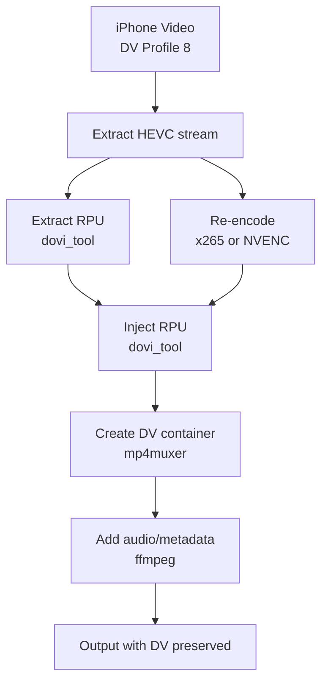

# iOS Media Toolkit

A command-line tool for processing iPhone photos and videos with Dolby Vision preservation, multiple encoding pipelines, and smart sync.

## Features

- **Album-based processing**: Process entire folders with a single command
- **Dolby Vision preservation**: Re-encode videos while keeping DV metadata intact
- **Multiple encoding pipelines**: x265 (CPU) and NVENC (GPU) with configurable quality presets
- **Smart sync**: SHA256 checksum comparison to skip identical files
- **Favorites detection**: Reads XMP sidecar metadata to identify favorites
- **Live Photo grouping**: Automatically pairs photo + video components
- **iPhone compatibility verification**: Validates codec tags, HDR metadata, and container boxes
- **Metadata preservation**: GPS location, creation date, device info

## Terminology

Before diving in, here are key terms used throughout this project:

| Term | Description |
|------|-------------|
| **HDR** | High Dynamic Range - wider brightness range than standard video (SDR) |
| **Dolby Vision (DV)** | Premium HDR format with frame-by-frame dynamic metadata |
| **HLG** | Hybrid Log-Gamma - HDR standard used by iPhone as DV base layer |
| **RPU** | Reference Processing Unit - Dolby Vision's dynamic metadata |
| **HEVC/H.265** | Video codec used by iPhone for 4K HDR recording |
| **x265** | Software (CPU) encoder for HEVC - slow but high quality |
| **NVENC** | NVIDIA hardware (GPU) encoder - fast but requires NVIDIA GPU |
| **CRF** | Constant Rate Factor - quality-based encoding (lower = better quality, larger file) |
| **VBR** | Variable Bit Rate - target bitrate encoding with quality fluctuation |
| **Codec tag** | Container metadata identifying video format (`hvc1` required for iPhone) |

## Background: The Dolby Vision Re-encoding Problem

### Motivation

iPhone 12 and later record 4K video in Dolby Vision Profile 8 at bitrates around 70-80 Mbps. This results in large files: a typical 30-second clip produces 200+ MB. For archival and storage optimization, re-encoding these files with x265 can achieve 80-90% compression with minimal perceptual quality loss.

However, standard re-encoding pipelines strip the Dolby Vision metadata. The resulting files play back as standard HDR (HLG), losing the dynamic tone mapping capabilities that distinguish Dolby Vision from static HDR formats.

### Technical Investigation

Initial testing with ffmpeg revealed that re-encoded files displayed "HDR" rather than "Dolby Vision" on iOS devices. Analysis of the container structure showed two distinct metadata components:

**Stream-level metadata (RPU)**: Dolby Vision embeds Reference Processing Unit data as supplemental enhancement information (SEI) NAL units within the HEVC bitstream. These contain per-frame tone mapping parameters, color volume transforms, and content-adaptive metadata. When the video is re-encoded, these NAL units are discarded since they reference the original frame data.

**Container-level signaling**: MP4 files use `dvcC` and `dvvC` configuration boxes to signal Dolby Vision presence to decoders. ffmpeg can copy these boxes when remuxing (`-c:v copy`), but cannot generate them when re-encoding because the stream-level metadata no longer exists.

### Solution Architecture

The preservation workflow requires three tools working in sequence:

1. **dovi_tool** ([quietvoid/dovi_tool](https://github.com/quietvoid/dovi_tool)): Extracts RPU data from the original HEVC stream before re-encoding, then injects it into the re-encoded stream. This works because RPU metadata describes relative adjustments rather than absolute values—the tone mapping parameters remain valid for re-encoded content with similar characteristics.

2. **mp4muxer** ([DolbyLaboratories/dlb_mp4base](https://github.com/DolbyLaboratories/dlb_mp4base)): Dolby's reference MP4 muxer that generates proper `dvcC`/`dvvC` container boxes by parsing the RPU data in the input HEVC stream.

3. **ffmpeg**: Handles the actual video re-encoding (x265 or NVENC) and final audio/metadata multiplexing.

### Implementation Details

The complete pipeline executes six operations:

1. Extract raw HEVC bitstream from source MOV container
2. Extract RPU binary data using dovi_tool
3. Re-encode video with x265/NVENC (compression occurs here)
4. Inject original RPU into re-encoded bitstream
5. Mux with mp4muxer to generate DV container boxes
6. Combine with audio track and copy metadata

Testing confirmed 85-91% size reduction while preserving the Dolby Vision signaling chain. Output files display "Dolby Vision" on iOS and trigger the appropriate HDR processing path on compatible displays.

### Notable Findings

**Codec tag compatibility**: HEVC streams can use either `hvc1` or `hev1` codec tags in MP4 containers. iOS requires `hvc1` for playback. The mp4muxer `--hvc1flag 0` parameter and ffmpeg `-tag:v hvc1` flag ensure correct tagging.

**RPU validity after re-encoding**: The RPU metadata remains functionally valid after re-encoding because it describes relative tone mapping adjustments. The re-encoded stream maintains similar scene brightness and color characteristics, allowing the original dynamic metadata to apply correctly.

**NVENC compatibility**: The workflow supports both CPU (x265) and GPU (NVENC) encoding. NVENC provides 10-20x faster encoding with acceptable quality for most use cases.

## Requirements

- Python 3.14+
- ffmpeg (with NVENC support for GPU encoding)
- exiftool

**For Dolby Vision preservation (all pipelines use these):**
- [dovi_tool](https://github.com/quietvoid/dovi_tool) - RPU extraction/injection
- [mp4muxer](https://github.com/DolbyLaboratories/dlb_mp4base) - DV container muxing

## Installation

```bash
git clone https://github.com/jgorostegui/ios-media-toolkit.git
cd ios-media-toolkit
uv sync
```

### Installing DV Tools

```bash
# dovi_tool (pre-built binary)
wget https://github.com/quietvoid/dovi_tool/releases/download/2.3.1/dovi_tool-2.3.1-x86_64-unknown-linux-musl.tar.gz
tar -xzf dovi_tool-*.tar.gz && sudo mv dovi_tool /usr/local/bin/

# mp4muxer (build from source)
git clone https://github.com/DolbyLaboratories/dlb_mp4base.git
cd dlb_mp4base/make/mp4muxer/linux_amd64 && make
sudo cp mp4muxer_release /usr/local/bin/mp4muxer
```

See [docs/dolby-vision-tools.md](docs/dolby-vision-tools.md) for detailed instructions.

## Usage

### Process Albums

```bash
imt process <album-name>            # Process a single album
imt process --all                   # Process all albums
imt process <album-name> --dry-run  # Preview without changes
```

### Compare Encoding Pipelines

```bash
imt compare video.MOV                          # Run all pipelines
imt compare video.MOV -p nvenc_4k -p balanced  # Run specific pipelines
imt list-pipelines                             # List available pipelines
```

### Verify Output Files

```bash
imt verify output.mp4                  # Check iPhone compatibility
imt verify output.mp4 -r original.MOV  # Compare against original
```

### Other Commands

```bash
imt albums              # List available albums
imt status <album>      # Show processing status
imt favorites <album>   # List favorite files
imt check               # Check system dependencies
imt transcode video.MOV --run  # Transcode single file
```

## Encoding Pipelines

All pipelines preserve Dolby Vision metadata when source has DV.

| Pipeline | Encoder | Resolution | Quality | Speed | Use Case |
|----------|---------|------------|---------|-------|----------|
| `archival` | x265 | 4K | CRF 20 | 0.02x | Maximum quality archival |
| `balanced` | x265 | 4K | CRF 25 | 0.24x | Good quality, reasonable time |
| `nvenc_4k` | NVENC | 4K | VBR 15M | 0.42x | Fast GPU encoding |
| `nvenc_1080p` | NVENC | 1080p | VBR 8M | 0.86x | Fast + smallest files |
| `compact` | x265 | 4K | CRF 28 | ~0.2x | Maximum compression |
| `preview` | NVENC | 1080p | VBR 4M | ~1x | Quick preview |

**Speed** is relative to video duration (1x = realtime, 0.5x = 2x slower than realtime).

### Choosing a Pipeline

- **Archival**: Use when storage isn't a concern and you want best quality
- **Balanced**: Good default for most use cases
- **NVENC 4K**: When you have an NVIDIA GPU and want fast encoding
- **NVENC 1080p**: Maximum compression with acceptable quality for sharing
- **Compact**: When storage is critical and you accept quality loss
- **Preview**: Quick check before committing to a slow encode

## Why Dolby Vision Matters

### The Problem

iPhone records video in **Dolby Vision Profile 8**, which provides:
- **Dynamic HDR**: Frame-by-frame brightness/contrast optimization
- **Better highlights**: Preserves detail in bright areas (sun, lights)
- **Better shadows**: Maintains detail in dark areas
- **Scene adaptation**: Adjusts tone mapping per-scene

When you re-encode with standard tools like ffmpeg:
```bash
ffmpeg -i input.MOV -c:v libx265 -crf 25 output.mp4  # DV is LOST!
```
The output plays as basic "HDR" - you lose the dynamic metadata.

### The Solution

This tool implements a 6-step workflow that preserves Dolby Vision:



### Two Levels of Dolby Vision

DV requires metadata at **two levels**, which is why standard tools fail:

| Level | What | Tool | Without It |
|-------|------|------|------------|
| **Stream** | RPU NAL units in HEVC bitstream | dovi_tool | No DV data in video |
| **Container** | `dvcC`/`dvvC` boxes in MP4 | mp4muxer | iPhone shows "HDR" not "Dolby Vision" |

ffmpeg can copy existing container boxes but **cannot generate them** when re-encoding.

## Configuration

Edit `config/global.yaml`:

```yaml
paths:
  source_base: "/path/to/input/albums"
  output_base: "/path/to/output"

tools:
  dovi_tool: "/usr/local/bin/dovi_tool"
  mp4muxer: "/usr/local/bin/mp4muxer"

transcode:
  enabled: true
  default_pipeline: "balanced"
```

## Verification

The `imt verify` command checks output files:

```bash
imt verify output.mp4 -r original.MOV
```

**Checks performed:**
- **Codec tag**: Must be `hvc1` (not `hev1`) for iPhone
- **DV container boxes**: `dvcC`/`dvvC` for "Dolby Vision" badge
- **HDR metadata**: BT.2020 primaries, HLG/PQ transfer
- **Metadata**: GPS, creation date, device info

### iPhone Compatibility

| Codec Tag | Status |
|-----------|--------|
| `hvc1` | ✓ Compatible |
| `dvh1` | ✓ Compatible (DV-specific) |
| `hev1` | ✗ Won't play on iPhone |

## Test Results

Tested on 12.4 MB iPhone video (4K, DV Profile 8, ~4 seconds):

| Pipeline | Output Size | Compression | Time | DV Preserved |
|----------|-------------|-------------|------|--------------|
| archival | 17.2 MB | -38%* | 251s | ✓ |
| balanced | 10.1 MB | 19% | 16s | ✓ |
| nvenc_4k | 8.5 MB | 31% | 9s | ✓ |
| nvenc_1080p | 4.7 MB | 62% | 4.5s | ✓ |

*Archival at CRF 20 can produce larger files than source if source was heavily compressed.

## References

- [dovi_tool](https://github.com/quietvoid/dovi_tool) - Dolby Vision RPU manipulation
- [dlb_mp4base](https://github.com/DolbyLaboratories/dlb_mp4base) - Dolby's official MP4 muxer
- [DoViMuxer](https://github.com/nilaoda/DoViMuxer) - Automated DV muxing wrapper

## License

MIT
